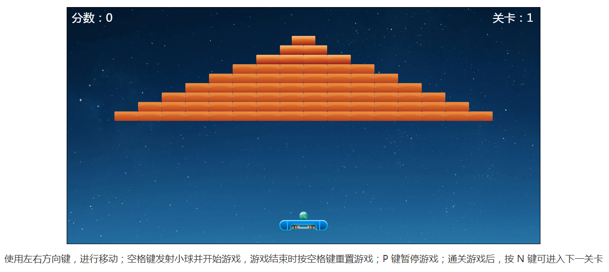

## h5小游戏—打砖块

本项目是利用原生js实现的h5小游戏，在实现时使用了大量es6语法，对于es6语法不太熟悉的小伙伴可以先查阅相关资料了解一下

**demo**：[线上地址](https://yangyunhe369.github.io/h5-game-blockBreaker/)

## 项目截图



## 已完成功能：
- [x] 设计多个关卡
- [x] 显示计分板
- [x] 特殊砖块血量更多
- [x] 小球撞击挡板多角度反弹
- [x] 小球与砖块撞击不同部位，反弹角度不同
- [x] 图片素材更新
- [x] 砖块不同血量下图片自动切换

## 待优化功能：
- [ ] 小球与挡板和砖块之间的碰撞模型不够精确

## 下载源码

``` bash
git clone https://github.com/yangyunhe369/h5-game-blockBreaker.git
```

## 目录结构

```
.
├─ index.html                   // 首页html
│  
├─ css                          // css样式资源文件
├─ images                       // 图片资源文件  
└─ js
   ├─ common.js                 // 公共方法
   ├─ scene.js                  // 游戏场景相关类
   ├─ game.js                   // 游戏主要运行逻辑
   └─ main.js                   // 游戏运行主函数
```

* common.js => 引入公共方法
* scene.js => 引入游戏场景素材相关类，包括砖块、小球、挡板、生成的砖块对象集合、计分板
* game.js => 引入游戏引擎
* main.js => 游戏运行主函数

## 项目更新

2018.1.11 — v1.1：优化代码，替换游戏图片资源文件。

2018.6.19 — v1.2: 优化代码，修复游戏不能通关bug。

## 说明

如果对您有帮助，您可以点右上角 "Star" 支持一下 谢谢！ ^_^

或者您可以 "follow" 一下，我会不断开源更多的有趣的项目

## 个人简介

作者：弦云孤赫(David Yang)

职业：web前端开发工程师

爱好：网游、音乐（吉他）

## 联系方式

QQ：314786482

微信：yangyunhe_yyh

坐标：四川成都

## License

[MIT](https://github.com/yangyunhe369/h5-game-blockBreaker/blob/master/LICENSE)
